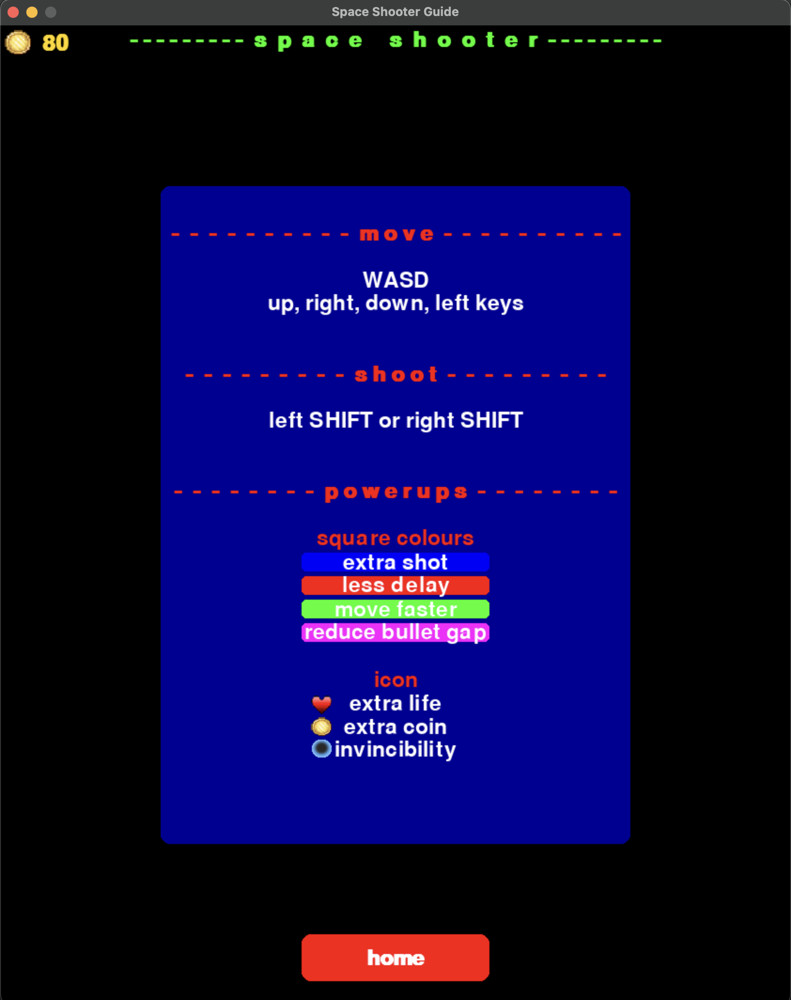

# SPACE SHOOTER

Space Shooter is a classic 2D space-themed shooting game developed using Python and Pygame.
Players control a spaceship, battle against waves of enemies, collect power-ups,
and strive to achieve the highest score possible.
Enhance your spaceship’s abilities, upgrade your firepower,
and navigate through challenging levels to become the ultimate space commander!

## Table of Content
- [Features](#Features)
- [Demo](#Demo)
- [Installation](#Installation)
- [Usage](#Usage)
- [Controls](#Controls)
- [Shop & Powerups](#Shop--Powerups)
- [Contributions](#Contributions)
- [Acknowledgements](#Acknowledgements)


## Features
- **Responsive Gameplay:** Smooth and responsive controls for an immersive gaming experience.
- **Upgradable Spaceship:** Enhance your spaceship’s speed, firepower, and other attributes through the in-game shop.
- **Diverse Power-ups:** Collect various power-ups like extra lives, invincibility,
and increased bullet capacity to gain an edge over enemies.
- **Dynamic Enemy Waves:** Face progressively challenging waves of enemies with varying behaviors and attack patterns.
- **Highscore Tracking:** Compete against your previous scores and aim for the top spot on the leaderboard.
- **Persistent Save Data:** Your upgrades, coins, and high scores are saved automatically,
allowing you to continue your journey seamlessly.
- **Intuitive User Interface:** Easy-to-navigate menus, shop, and in-game displays provide a user-friendly experience.

## Demo
### Main Menu


### Shop


### Guide


### Game Play


## Installation
### Prerequisites
- **Python 3.7 or higher:** Ensure you have Python installed on your system. You can download it from [here](https://www.python.org/downloads/).
- **Pygame:** The game is build using Pygame. Installation instructions are provided below.

### Steps
1. **Clone the Repository**
    ```bash
    git clone
    ```
2. **Move into the Repository**
    ```bash
    cd space_shooter
    ```
3. **Set Up a Virtual Environment (Optional but Recommended)**
    ```bash
    python -m venv venv
    source venv/bin/activate
    # on windows
    venv\Scripts\activate
    ```
4. **Install dependencies**
    ```bash
    pip install -r requirements.txt
    ```

## Usage
Run the game by execution the main.py file:
```bash
  python main.py
```
The game window will launch, and you'll be greeted with the start menu.
From there, you can navigate through the game, shop and guide section.

## Controls
- **Move Left:** *A* or *Left Arrow*
- **Move Right:** *D* or *Right Arrow*
- **Move Up:** *W* or *Up Arrow*
- **Move Down:** *S* or *Down Arrow*
- **Shoot:** *Left Shift* or *Right Shift*
- **Pause Game:** *P*
- **Start Game:** *Enter*
- **Quit Game:** *Escape*

## Shop & Powerups
Upgrade your spaceship and enhance your gameplay through the in-game shop.
Use the coins you collect during the game to purchase the following upgrades:
- **Speed:** Increase your spaceship's movement speed.
- **Extra Shot:** Gain additional bullet capacity for more firepower.
- **Reduce Bullet Gap:** Decrease the time between consecutive shots.
- **Extra Coin:** Boost your coin collection rate.
- **Invincibility:** Temporarily make your ship invincible to enemy attacks.

Collect powerups during the gameplay to gain temporary advantages and improve your chances of survival.

## Contributions
Contributions are welcome! If you'd like to contribute to Space Shooter, please follow these guidelines:
1. **Fork Repository**
2. **Create a New Branch**
    ```bash
    git checkout -b feature/YourFeature
    ```
3. **Commit Your Changes**
    ```bash
    git commit -m 'Add some feature'
    ```
4. **Push to the Branch**
    ```bash
    git push origin feature/YourFeature
    ```
5. **Open a Pull Request**
    Please ensure your code follows the project's coding standards and includes appropriate comments and documentation.

## Acknowledgements
- **Pygame:** The game is build using the Pygame library.
Thanks to the Pygame community for their continuous support and development.

#
Feel free to reach out for any questions or feedback, Happy gaming!